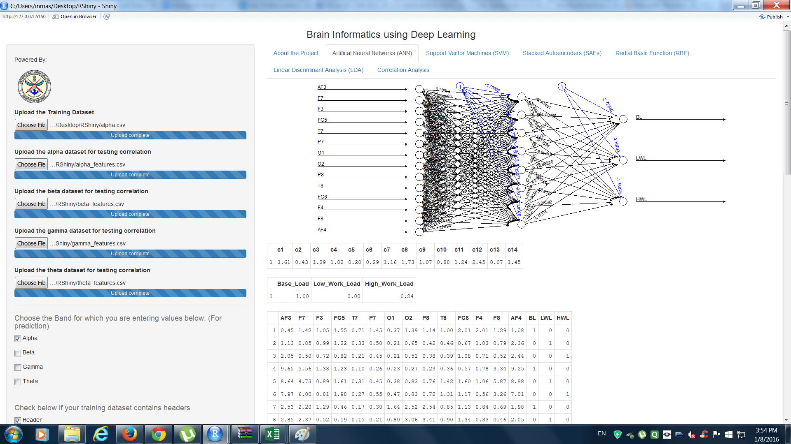
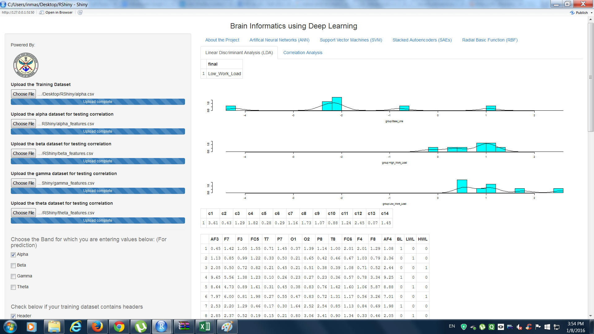

# Brain-informatics using Deep-learning

This Project was under guidance of Vikramank Singh (UC Berkley), which aimed to classify stress levels using data obtained from 14 channel EEG Machine. 

Electroencephalogramic (EEG) machine, was used to record 14 channel data (AF, F, FC, O, T) of​ brain.
The​​ filtered ​​data ​​was ​​pass​ ​through​​Butterworth​​filter ​​to ​​extract ​​features ​​of ​​EEG ​​Signals. T
he target or the aim was to classify workload of a person into High, Medium, Low using Artificial Neural Networks, Support vector machine, Stack Encoders, LDAs. 

The applications of this automated deep learning system can be used in Army, Corporate to check whether a person is under High workload or if an Army personnel is too worked up because of post-war trauma.

Tools/Technologies:
+ EEG
+ RShiny
+ R
+ Libraries: shiny, forecast, e1071, kernlab, deepnet, RSNNS, neuralnet, MASS, Hmisc, eegkit, eegAnalysis, shinyRGL

UI:

Artificial Neural Networks

Linear Discriminant Analysis

